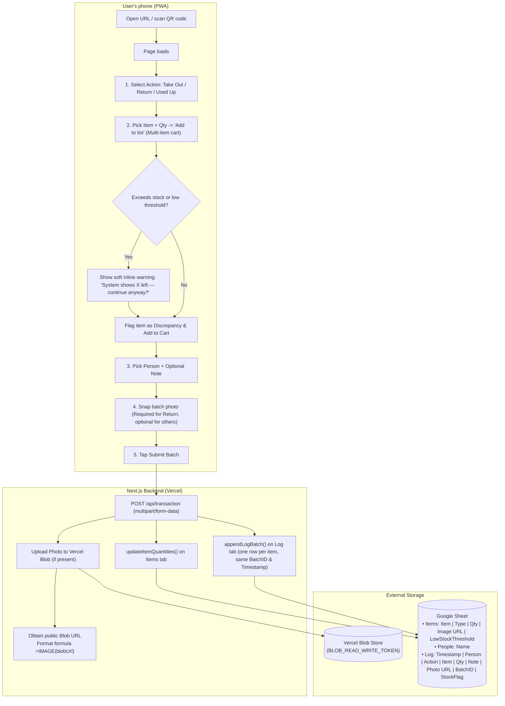
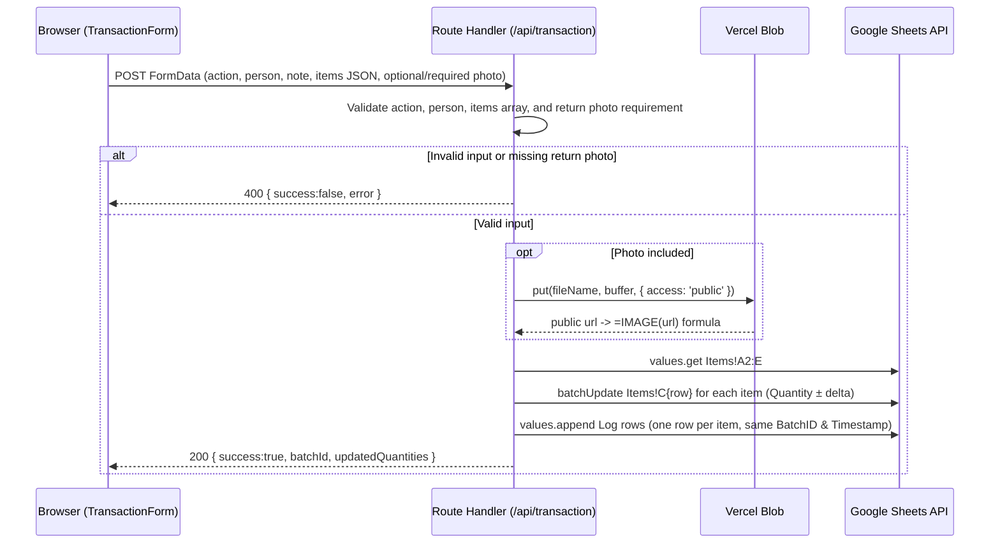

# Architecture

The Storage Check-Out Tracker is a single Next.js app (frontend + backend in one)
that reads and writes a Google Sheet through a Google Cloud service account, and
uploads batch checkout photos to Vercel Blob.
There is no database and no external server infrastructure needed.

## Components

| Component | Role |
|---|---|
| **Browser / PWA** (phone) | Loads the app, supports multi-item cart flow, batch camera photo capture, "Add to Home Screen" |
| **Next.js Server Component** (`app/page.tsx`) | Runs on page load; fetches live `Items` + `People` data for the cart form |
| **Dashboard Page** (`app/dashboard/page.tsx`) | Audit overview, filtered `⚠ Stock Discrepancies` log, live catalog, stock adjustments |
| **Next.js Route Handlers** (`app/api/transaction`, `app/api/adjust-stock`) | Validates batch inputs, uploads batch photo to Vercel Blob, mutates sheet quantities, appends log rows |
| **`lib/sheets.ts`** | The central helper module for Google Sheets API operations & Vercel Blob photo uploads |
| **Vercel Blob** | Free tier object store for single batch checkout photos; returns public URLs for in-sheet thumbnail formulas |
| **Google Sheets API** | Accessed with a service account (no end-user OAuth login) |
| **Google Sheet** | Three tabs: `Items`, `People`, `Log` — the entire data store |

## High-level flow

## What happens on batch submit (`/api/transaction`)

## Key design decisions

- **Multi-item cart flow**: users build a running list of items, edit quantities or
  remove lines, and submit the entire batch in one transaction.
- **Soft stock validation**: the app never blocks a checkout because of computed
  stock. It displays a friendly inline confirmation and tags the row with
  `StockFlag = Discrepancy` in the `Log` tab.
- **Single batch checkout photo via Vercel Blob**: one camera snap per batch
  (required for Returns, optional for Take Out/Used Up). The backend uploads it to
  Vercel Blob and writes `=IMAGE("https://...")` into the Sheet's `Photo URL` column so
  the live thumbnail renders directly in Google Sheets.
- **Stock adjustments**: admins can correct stock counts from the Dashboard (`/dashboard`),
  which records an explicit `Action = StockAdjustment` audit row in the `Log` tab.
- **Access control**: Zero accounts or sign-ins required for regular users (anyone with the link or QR code can check out items). The Dashboard is protected via an Admin Password and hidden behind a discreet 5-tap header easter egg.

## Nothing is deployed

This project has **not** been deployed or connected to any live Google Sheet,
Vercel project, or domain. See [`docs/admin-guide.md`](./admin-guide.md) for the
steps to connect credentials and deploy.
